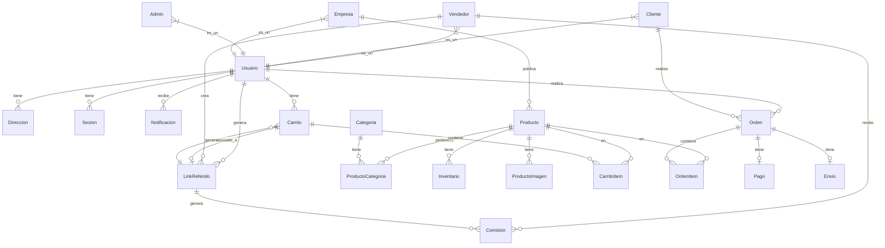
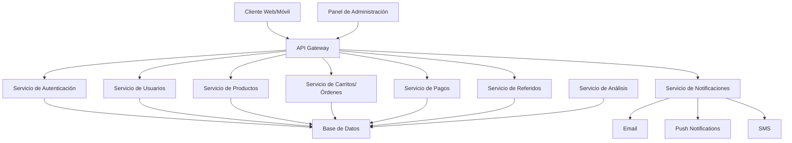

### Estructura para "Refferby"

Como programador senior, te presento la estructura recomendada para tu proyecto de marketplace con sistema de referidos.

## Visión General del Proyecto

Refferby será un marketplace donde los vendedores pueden crear carritos de compra para sus clientes mediante links de referidos, generando comisiones por ventas. El sistema tendrá cuatro tipos de usuarios con diferentes permisos y funcionalidades.

### Descripción de Modelos

#### 1. Usuario (Base)

- **Campos**:

- id (PK)
- email
- password (hash)
- nombre
- apellido
- telefono
- fecha_nacimiento
- tipo_usuario (enum: cliente, vendedor, admin, empresa)
- estado (activo, inactivo, suspendido)
- fecha_registro
- ultima_conexion

#### 2. Cliente

- **Campos**:

- id (PK)
- usuario_id (FK)
- preferencias_compra (JSON)
- historial_navegacion (JSON)

#### 3. Vendedor

- **Campos**:

- id (PK)
- usuario_id (FK)
- biografia
- nivel (básico, intermedio, avanzado)
- porcentaje_comision
- balance_actual
- datos_bancarios (JSON)
- documentos_verificacion (JSON)

#### 4. Admin

- **Campos**:

- id (PK)
- usuario_id (FK)
- nivel_permisos
- departamento

#### 5. Empresa

- **Campos**:

- id (PK)
- usuario_id (FK)
- nombre_empresa
- rif/nit/identificacion_fiscal
- descripcion
- sitio_web
- documentos_verificacion (JSON)

#### 6. Direccion

- **Campos**:

- id (PK)
- usuario_id (FK)
- tipo (facturación, envío)
- calle_principal
- calle_secundaria
- numero
- ciudad
- estado/provincia
- pais
- codigo_postal
- referencias
- predeterminada (boolean)

#### 7. Producto

- **Campos**:

- id (PK)
- empresa_id (FK)
- nombre
- descripcion
- precio_base
- descuento
- precio_final
- sku
- estado (activo, inactivo, agotado)
- destacado (boolean)
- fecha_creacion
- fecha_actualizacion
- especificaciones (JSON)

#### 8. ProductoImagen

- **Campos**:

- id (PK)
- producto_id (FK)
- url
- orden
- es_principal (boolean)

#### 9. Categoria

- **Campos**:

- id (PK)
- nombre
- descripcion
- categoria_padre_id (FK, self-reference)
- nivel
- imagen_url

#### 10. ProductoCategoria (Tabla pivote)

- **Campos**:

- producto_id (FK)
- categoria_id (FK)

#### 11. Inventario

- **Campos**:

- id (PK)
- producto_id (FK)
- cantidad_disponible
- cantidad_reservada
- ubicacion_almacen
- alerta_stock_bajo
- fecha_actualizacion

#### 12. Carrito

- **Campos**:

- id (PK)
- usuario_id (FK)
- link_referido_id (FK, nullable)
- estado (activo, abandonado, convertido)
- fecha_creacion
- fecha_actualizacion
- notas

#### 13. CarritoItem

- **Campos**:

- id (PK)
- carrito_id (FK)
- producto_id (FK)
- cantidad
- precio_unitario
- subtotal

#### 14. LinkReferido

- **Campos**:

- id (PK)
- vendedor_id (FK)
- codigo (único)
- url_completa
- fecha_creacion
- fecha_expiracion (opcional)
- usos_totales
- usos_maximos (opcional)
- estado (activo, inactivo, expirado)

#### 15. Orden

- **Campos**:

- id (PK)
- usuario_id (FK)
- link_referido_id (FK, nullable)
- estado (pendiente, pagada, enviada, entregada, cancelada)
- subtotal
- impuestos
- descuentos
- total
- fecha_creacion
- fecha_actualizacion
- notas

#### 16. OrdenItem

- **Campos**:

- id (PK)
- orden_id (FK)
- producto_id (FK)
- cantidad
- precio_unitario
- subtotal

#### 17. Pago

- **Campos**:

- id (PK)
- orden_id (FK)
- metodo_pago
- estado (pendiente, completado, fallido, reembolsado)
- monto
- referencia_transaccion
- fecha_pago
- detalles_pago (JSON)

#### 18. Envio

- **Campos**:

- id (PK)
- orden_id (FK)
- metodo_envio
- costo_envio
- direccion_envio_id (FK)
- estado (pendiente, en_proceso, enviado, entregado)
- numero_seguimiento
- fecha_estimada_entrega
- fecha_envio
- fecha_entrega

#### 19. Comision

- **Campos**:

- id (PK)
- vendedor_id (FK)
- orden_id (FK)
- link_referido_id (FK)
- monto
- porcentaje
- estado (pendiente, pagada, cancelada)
- fecha_generacion
- fecha_pago

#### 20. Sesion

- **Campos**:

- id (PK)
- usuario_id (FK)
- token
- ip
- dispositivo
- navegador
- fecha_inicio
- fecha_expiracion
- activa (boolean)

#### 21. Notificacion

- **Campos**:

- id (PK)
- usuario_id (FK)
- tipo
- titulo
- mensaje
- leida (boolean)
- fecha_creacion
- fecha_lectura
- datos_adicionales (JSON)

## Flujos de Usuario

### Registro y Autenticación

1. **Registro de Cliente**:

1. Formulario básico con datos personales
2. Verificación por email
3. Creación automática de perfil cliente

2. **Registro de Vendedor/Empresa**:

1. Solo por invitación del Admin
2. Formulario extendido con datos adicionales
3. Verificación de documentos
4. Aprobación manual por Admin

3. **Login**:

1. Email/contraseña
2. Redirección automática según tipo de usuario
3. Opción "recordarme"
4. Recuperación de contraseña

### Flujo de Vendedor

1. **Creación de Links de Referido**:

1. Generación de código único
2. Opción para personalizar URL
3. Configuración de caducidad/usos máximos

2. **Gestión de Carrito para Cliente**:

1. Selección de productos
2. Ajuste de cantidades
3. Aplicación de descuentos (si aplica)
4. Envío de link al cliente

3. **Seguimiento de Ventas**:

1. Dashboard con estadísticas
2. Historial de links generados
3. Comisiones pendientes/pagadas

### Flujo de Cliente

1. **Compra Regular**:

1. Navegación por catálogo
2. Añadir productos al carrito
3. Checkout y pago

2. **Compra por Referido**:

1. Acceso mediante link de referido
2. Carrito pre-configurado
3. Opción de modificar carrito
4. Checkout y pago

### Flujo de Empresa

1. **Gestión de Productos**:

1. Creación/edición de productos
2. Gestión de inventario
3. Configuración de precios/descuentos

2. **Seguimiento de Ventas**:

1. Dashboard con estadísticas
2. Reportes de ventas por producto/categoría

### Flujo de Admin

1. **Gestión de Usuarios**:

1. Aprobación de vendedores/empresas
2. Gestión de permisos
3. Suspensión/activación de cuentas

2. **Configuración del Sistema**:

1. Ajuste de comisiones
2. Gestión de categorías
3. Parámetros generales

## Arquitectura Técnica Recomendada

## Consideraciones Adicionales

### Seguridad

- Implementar autenticación JWT
- Roles y permisos granulares
- Protección contra CSRF, XSS
- Encriptación de datos sensibles
- Auditoría de acciones críticas

### Escalabilidad

- Diseño modular para crecimiento
- Posibilidad de microservicios a futuro
- Caché para productos/categorías populares
- Optimización de consultas a base de datos

### Funcionalidades Futuras

- Sistema de reseñas y valoraciones
- Programa de fidelización
- Chat en vivo para vendedores-clientes
- Integración con redes sociales
- Aplicación móvil nativa

### Integraciones Recomendadas

- Pasarelas de pago (Stripe, PayPal, etc.)
- Servicios de envío y tracking
- Herramientas de análisis (Google Analytics, Mixpanel)
- CRM para gestión de clientes
- Herramientas de marketing por email

## Recomendaciones para el Prototipo

Para la fase inicial de prototipo, recomiendo:

1. Enfocarse en el flujo principal: registro, creación de links de referido, compra mediante referido
2. Implementar los modelos core: Usuario, Vendedor, Cliente, Producto, LinkReferido, Carrito, Orden
3. Crear interfaces básicas pero funcionales para cada tipo de usuario
4. Utilizar una base de datos relacional para mantener la integridad de las relaciones
5. Implementar un sistema básico de comisiones para validar el concepto
